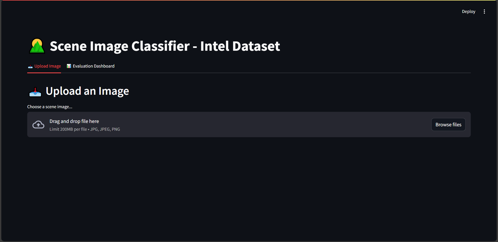
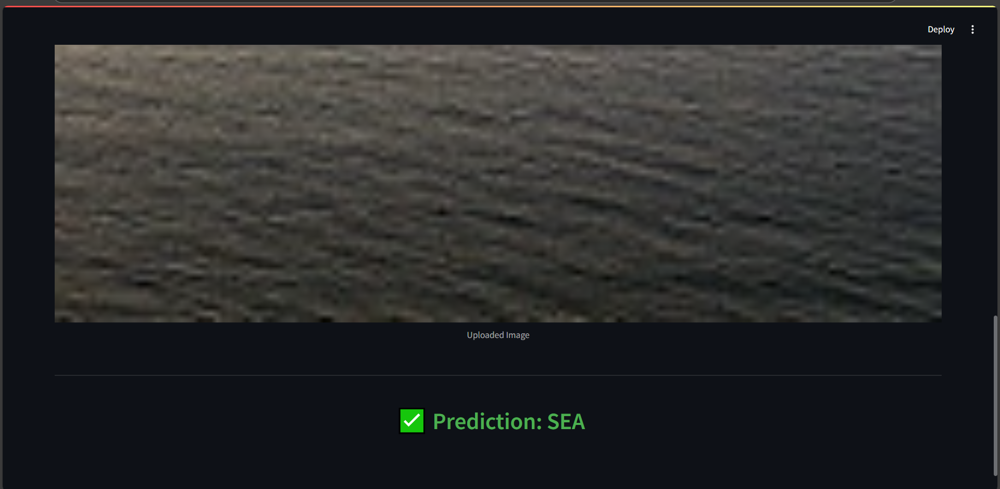
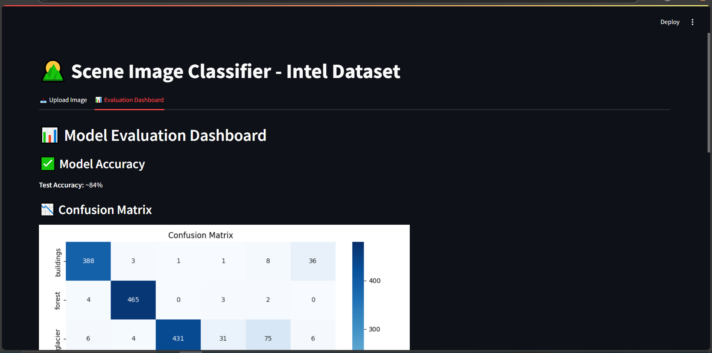
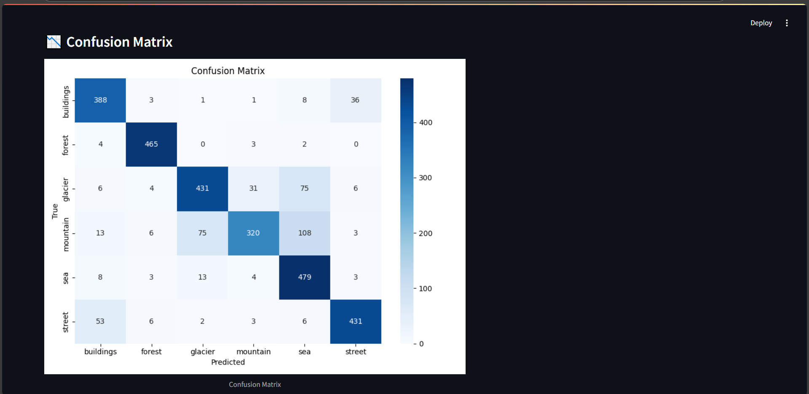
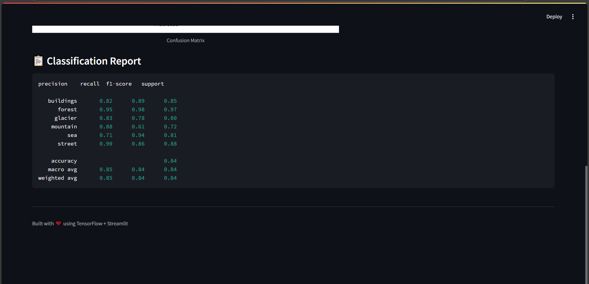

# 🌄 Scene Image Classifier (Intel Dataset)

## 📌 Project Overview
This project builds a Convolutional Neural Network (CNN) from scratch to classify natural scene images into 6 categories:

- buildings, forest, glacier, mountain, sea, street

The project also includes a **Streamlit dashboard** for uploading images, viewing predictions, and visualizing evaluation metrics interactively.

---

## 📁 Dataset

**Source**: [Intel Image Classification Dataset (Kaggle)](https://www.kaggle.com/datasets/puneet6060/intel-image-classification)

- `seg_train/` → Training data (organized by class)
- `seg_test/` → Validation/testing data
- `seg_pred/` → Unlabeled data used for predictions

---

## 🧠 Model Architecture

A custom-built CNN model:

- 4 Conv2D layers with ReLU + MaxPooling
- BatchNormalization & Dropout
- Flatten → Dense(256) → Dense(6) with softmax
- Trained for 10 epochs with:
  - `Adam` optimizer
  - `categorical_crossentropy` loss
  - EarlyStopping + ReduceLROnPlateau

---

## 📊 Model Evaluation

- ✅ **Validation Accuracy**: ~84%
- 📋 **Classification Report** (summary shown in dashboard)
- 📉 **Confusion Matrix**: `outputs/confusion_matrix.png`
- 🖼️ **Predicted Images**: Saved in `outputs/predictions/` from `seg_pred`

---

## 🧪 Live Prediction Interface

A fully interactive **Streamlit app**:
- 📤 Upload a scene image
- ✅ Model predicts and displays the result
- 📊 Tabs show evaluation metrics (accuracy, matrix, report)

---

## 📦 Folder Structure

<pre> image_classifier/ ├── seg_train/ # Training dataset (ignored in Git) ├── seg_test/ # Validation dataset (ignored in Git) ├── seg_pred/ # Unlabeled prediction input (ignored in Git) ├── model/ │ └── cnn_intel_model.h5 # Trained model weights ├── outputs/ │ ├── confusion_matrix.png # Evaluation result │ └── predictions/ # Predicted output images (optional) ├── train_model.py # Model training script ├── evaluate_model.py # Evaluation + confusion matrix generation ├── predict_images.py # Batch predictions from seg_pred/ ├── app.py # Streamlit dashboard app ├── requirements.txt └── README.md </pre>

## 🚀 How to Run the Project

### 1. 🧰 Install Requirements
pip install -r requirements.txt
2. 🧠 Train the Model

python train_model.py
The model will be saved as model/cnn_intel_model.keras

3. 📊 Evaluate the Model

python evaluate_model.py
Outputs classification report + confusion_matrix.png

4. 🔍 Predict from Unlabeled Images

python predict_images.py
Results saved in outputs/predictions/

5. 🌐 Launch Streamlit App

streamlit run app.py
Opens dashboard in browser with upload + evaluation tabs

> 📂 Dataset folders and prediction outputs are excluded from GitHub and should be downloaded or generated locally. See `.gitignore`.

---

## 🖼️ Screenshots

### 🔹 Upload & Prediction Interface

---

### 🔹 Prediction Result Output

---

### 🔹 Evaluation Dashboard View

---

### 🔹 Confusion Matrix

---

### 🔹 Classification Report

---

### ✅ Requirements

tensorflow
numpy
matplotlib
pillow
seaborn
scikit-learn
streamlit
---

###🙌 Credits
Dataset: Kaggle - Intel Scene Classification
---
Developed with ❤️ using TensorFlow + Streamlit

